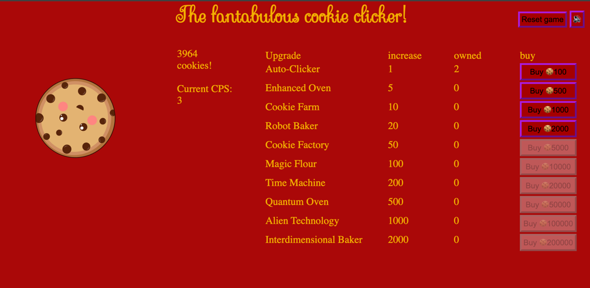

# tech-edu-week03-cookie-clicker
Tech Educators week 3 cookie clicker
# Yet another cookie clicker

This project is a mini-game-esque cookie clicker which presents as a single standalone page.

# Deployment
This project is provided as a standalone website which can be deployed using a 
standard web server able to serve static content, or on a platform such as github pages.

if you wish to deploy this project, please fork this repo, and go to the repository settings,
code and automation > pages, and then select the deployment branch, by default, this will be master.

To deploy this to a standard web server, please upload the contents of this repository to the web root you
wish to use.

# Feedback
The upgrades that are available within the game are fetched from the web API that was provisioned
for this assignment, which are then presented to the user for purchasing.

I aimed to break down the logic into various operational marks in order to seperate them down
into functions aimed to do a task, such as updating the CPS which is called during game init but,
also during shop upgrading.

The site is handled as a single page in which updates dynamically using javascript timers to allow
us to manage the tick loop, including operations such as automatically saving the player data
periodically so that we can load it back on reloading, and automatically incrementing the cookie counter.

I added some small amount of animation to the game for visuals and some small amount of feedback,
such as shaking a button if a user tries to click it to upgrade when it's not available.

# Reflection
CSS is still an area in which I'm coming to grips with, while I find my that general programming
skills are competent and allow me to pull of various things, I find that the concept of getting
them onto the page and styling them feels like the biggest barrier. In part, that is somewhat
down to me still learning how CSS works, but, also, some slight lack of faith in my ability to
design something that I can put into action.
